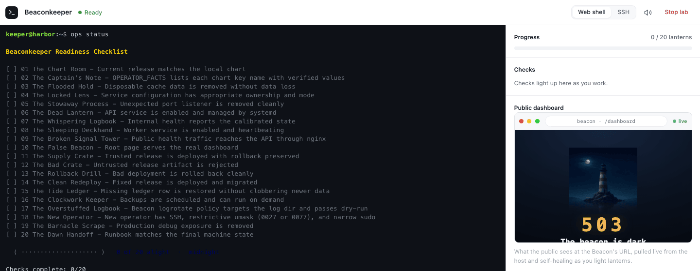
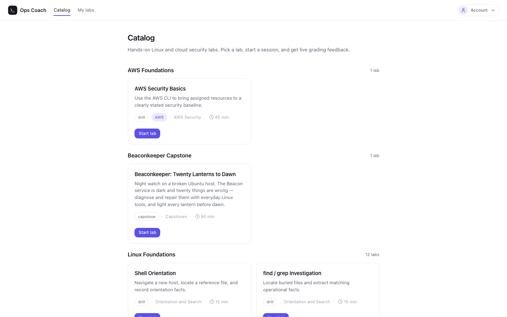

# OpsCoach

Learn Linux and cloud operations on a disposable server instead of a quiz.

You open a lab, get your own Linux host within a minute or two, fix what is broken from a terminal in the browser, and a grader SSHes into the live machine to check whether you fixed it.

The catalog ships with **Linux Foundations** and **AWS Foundations** drills plus **Beaconkeeper**, a capstone that drops you onto a broken Ubuntu host with twenty faults to diagnose and repair on one box before time runs out.

## What it looks like

A session puts a terminal on the lab host next to a grader that checks the machine's state as you work.

Here is the Beaconkeeper capstone. In the browser terminal, `ops status` lists the twenty faults left to fix; the public dashboard shows the beacon still dark.



The catalog groups the Linux and cloud-ops drills with the Beaconkeeper capstone:



This repository is the public source. OpsCoach deploys on a shared AWS platform behind single sign-on and provisions a fresh host per session, so there is no open public demo; the screenshots above are the running app.

## How it works

A request reaches a shared load balancer, authenticates through Cognito, and lands on the OpsCoach web app running on ECS Fargate. Starting a lab launches the session's EC2 host; the web app bridges the browser terminal to it over SSH, and runs the grader over SSH. Grading streams pass/fail checks to a dashboard beside the terminal, so progress is visible as the box changes.

For the whole system, **[architecture.md](docs/architecture.md)** is the walkthrough: the numbered diagram, the provision, terminal, grade, and teardown flows, and the design forks behind them. Where the stakes are highest, two docs go deeper:

- **[security.md](docs/security.md)**: how untrusted users get root without putting anything else at risk.
- **[lab-lifecycle-design.md](docs/lab-lifecycle-design.md)**: how a host is provisioned and the three independent paths that guarantee it dies.

To run it on your laptop, jump to [Run it locally](#run-it-locally).

## Why it is built this way

The security model starts from a concession: the lab container has to run privileged, so assume it will be escaped and make escaping it worthless. A learner fixing systemd or filesystem state needs genuine root, and no container flag makes that fully safe. So the boundary that matters is the host under the container, not the container itself. Each host is single-tenant, so an escape reaches only the learner's own machine. Nothing worth stealing lives on it: its credentials pull a lab image and write logs, and that is the whole list. And it dies on a timer. The worst an escape can do is get full control of one throwaway box for at most an hour, with no credentials worth carrying off. The deeper model is in **[security.md](docs/security.md)**.

That only holds if each host is its own machine. A shared host or a browser-only container would make container isolation the lone wall between a hostile learner and everyone else, so one escape would compromise every session at once. A per-session host spends a visible cost instead, a minute or two of provisioning and a per-session bill, to buy the isolation the security model rests on.

Grading made its own demand. A fixed answer key tells you a learner typed the expected command, not that the box ended up right. So the grader SSHes into the live host with a least-privilege environment and inspects the machine itself: services up, files in place, config correct. A check passes only when the box is in the right state. The cost lands in authoring: every pack ships grader code that runs against a live machine. A check can fail because the system changed under it, not only because the learner did.

The system owns no platform of its own, on purpose. It does not create a VPC, load balancer, or Cognito pool; it imports an existing shared set by ID, the way a service joins an organization that already runs those. The actual IDs stay in local config, out of the repo. A shared environment forces that deployment, and OpsCoach builds to it from the start.

## Repository layout

| Path | What it is |
| --- | --- |
| `web/` | Next.js app and custom Node server (the WebSocket-to-SSH bridge), API routes, UI |
| `infra/` | AWS CDK app: Fargate service, per-session lab hosts, teardown automation |
| `ContentPacks/` | Labs and graders, including the Beaconkeeper capstone |
| `scripts/` | Build, deploy, and smoke-test scripts |
| `docs/` | Architecture, security, and design notes |

## Run it locally

```bash
cd web
npm install
cp .env.example .env      # most values are optional locally
npm run dev
```

That gets you the catalog and the play flow offline. With no `EC2_LAUNCH_TEMPLATE_ID` set, the app runs in mock mode: provisioning is faked and a session reports ready immediately. With no `DATABASE_URL`, sessions live in an in-memory store. Run the tests with `npm test`.

One gap is left on purpose: mock mode does not start a lab container, so a live terminal and live grading need a container listening locally. The smoke script can bring one up. What is wired and what is still stubbed is in **[local-dev-without-aws.md](docs/local-dev-without-aws.md)**.

## Configure and deploy

Deployment needs two files that stay out of version control (both are in `.gitignore`): the app's `web/.env`, copied from `web/.env.example`, and the CDK platform context `infra/cdk.context.json`, copied from `infra/cdk.context.example.json` or generated by `scripts/discover-platform-context.sh`. With those in place, `scripts/deploy-platform.sh` builds the images and deploys the stacks. The step-by-step walkthrough is in **[../infra/PLATFORM_INTEGRATION.md](infra/PLATFORM_INTEGRATION.md)**.

## License

MIT. See [../LICENSE](LICENSE).
