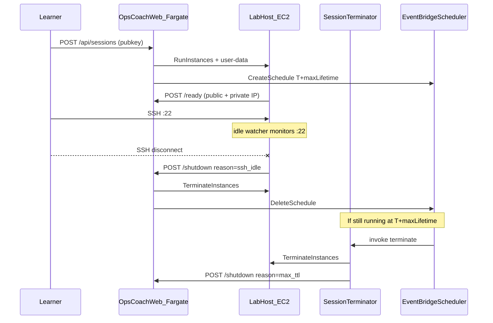

# Lab instance lifecycle design

**Status: implemented (web + CDK).**

Each learner session runs on a dedicated EC2 host that must be torn down reliably, because a leaked instance costs real money and there is no human watching. Teardown uses **three independent paths**, any one of which is sufficient and all of which are safe to run twice. This doc records how hosts are provisioned and destroyed, and why a single cleanup mechanism was not enough.

## Problem

Starting a session launches a dedicated EC2 instance (`t4g.micro`) running Docker with the lab container. If teardown fails or never runs, instances leak and accumulate cost.

The control plane (Next.js on Fargate) cannot reliably observe when a learner is done. It bridges the browser terminal over a WebSocket, but a learner can also SSH straight to the host's public IP and bypass the control plane entirely, and even within the bridged terminal the control plane does not see SSH connect or disconnect events. So idle has to be detected on the host, not inferred from the control plane.

Teardown therefore needs to be:

- **Prompt** when the learner is done (SSH idle).
- **Reliable** when callbacks fail, schedules are missed, or the learner never connects.
- **Idempotent** when multiple paths fire close together.

## Architecture context



**Key constraints:**

- SSH is pubkey-only on a hardened host (v1: public IP; no Tailscale).
- The grader runs from Fargate inside the VPC and SSHes to the instance's **private IP**.
- Session state lives in Postgres; EC2 lifecycle is driven by the web task role and the terminator Lambda.

## Why three paths

A single teardown mechanism is a single point of failure for the one control that bounds spend, so the design layers three independent paths. Any one succeeding is sufficient, and all are safe to run more than once.

| Layer | Trigger | Actor | Typical latency |
|-------|---------|-------|-----------------|
| 1. SSH idle watcher | No established TCP sessions on host `:22` for a grace period, after at least one session was seen | EC2 user-data background script | ~2 min after disconnect |
| 2. Max TTL schedule | One-time EventBridge Scheduler at provision time | `OpsCoachSessionTerminator` Lambda | Exactly at T + max lifetime |
| 3. ExpiresAt sweep | `ExpiresAt` EC2 tag in the past | Same Lambda, every 5 min | Up to 5 min after tag expiry |

Manual **Stop lab** (the learner button) and the authenticated `POST /api/sessions/:id/stop` use the same internal shutdown path as the webhooks.

The layers cover each other's failure modes:

- **Idle watcher alone is not enough.** The control plane does not terminate SSH, so without a host-side agent it would learn that a session is idle only when the learner clicks Stop or a coarse timer fires. The watcher closes the common case: the learner closes their terminal and walks away.
- **A timer alone is not enough.** Fixed timers are either too aggressive (they kill active sessions) or too loose (they leak nodes). A max lifetime is still necessary as a backstop for failed shutdown webhooks, learners who never SSH (the instance still costs money), and bugs in the idle watcher.
- **Scheduler and sweep are both kept** because they fail differently. The Scheduler fires once per session at a precise time and deletes itself, which is the primary hard cap; the `ExpiresAt` tag plus sweep catches instances where schedule creation itself failed (missing IAM, an API error during provision) or where AWS Scheduler drifted.

## Layer 1: SSH idle watcher

**Location:** generated shell user-data in [`../web/lib/lab-user-data.ts`](../web/lib/lab-user-data.ts) (also mirrored in [`../infra/lib/lab-user-data.sh`](../infra/lib/lab-user-data.sh) for launch-template defaults).

**Behavior:**

1. After bootstrap, a background subshell loops every 15 seconds.
2. Count established connections on local port 22 via `ss -tn state established '( sport = :22 )'`.
3. Track `had_session`: set to 1 once the count is greater than 0 at least once.
4. When `had_session` is 1 and the count is 0, start an idle clock.
5. If idle for `SSH_IDLE_GRACE_SECONDS` (default **120**), POST the shutdown webhook.

**Webhook:**

```http
POST /api/sessions/:id/shutdown
X-Internal-Secret: <shared secret>
Content-Type: application/json

{ "reason": "ssh_idle" }
```

The 120-second grace avoids tearing down during a brief disconnect (a network blip or an `ssh` reconnect) and lets grader SSH from Fargate finish without racing the learner's disconnect in edge cases.

**Two known limitations, both acceptable for v1:**

- The watcher counts **all** connections on host `:22`, including grader SSH from the VPC. A learner who never opens a terminal but repeatedly runs checks from the web UI may still see the instance terminated shortly after grading quiesces. A follow-up could filter by source IP (count only non-RFC1918 addresses).
- If the learner never SSHes, `had_session` stays 0 and the watcher never fires. Max TTL (layer 2) handles that case.

## Layer 2: One-time EventBridge schedule (max TTL)

**Location:** [`../web/lib/session-scheduler.ts`](../web/lib/session-scheduler.ts), invoked from [`../web/lib/ec2-labs.ts`](../web/lib/ec2-labs.ts) after `RunInstances`.

**Behavior:**

1. On successful provision, Fargate creates schedule `opscoach-{sessionId}` (truncated to 64 chars).
2. Expression: `at(yyyy-mm-ddThh:mm:ss)` in UTC, **T + maxLifetimeMinutes** from provision time.
3. Target: the `OpsCoachSessionTerminator` Lambda with payload:

   ```json
   { "action": "terminate", "instanceId": "i-…", "sessionId": "…", "reason": "max_ttl" }
   ```

4. `ActionAfterCompletion: DELETE` removes the schedule after it fires.
5. Any explicit shutdown (`manual`, `ssh_idle`) calls `DeleteSchedule` for idempotency.

The default max lifetime is **60 minutes** (`OPSCOACH_MAX_LIFETIME_MINUTES` / CDK context `maxLifetimeMinutes`): long enough for a typical lab session and assessment retries, short enough to bound cost if every other teardown path fails, and orthogonal to the SSH idle grace.

EventBridge Scheduler is used rather than EventBridge Rules because it supports **one-time** schedules natively, with per-session names and auto-delete. Rules suit recurring patterns, which is why the 5-minute sweep (layer 3) uses one.

## Layer 3: ExpiresAt tag sweep

**Location:** [`../infra/lib/session-terminator/handler.py`](../infra/lib/session-terminator/handler.py), triggered every 5 minutes by an EventBridge Rule in [`../infra/lib/lab-host-stack.ts`](../infra/lib/lab-host-stack.ts).

**Behavior:**

1. At provision, `RunInstances` tags the instance with `ExpiresAt=<ISO8601>` aligned to the **max lifetime** (the same horizon as the scheduler).
2. The Lambda scans running OpsCoach instances (`OpsCoach=true`).
3. If `ExpiresAt <= now`, it terminates the instance and calls the shutdown API with `reason=expires_at_sweep`.

This is the cheap safety net for when schedule creation failed or an instance outlived its schedule because of API errors.

## Unified shutdown path

All automated and manual teardown converges on [`shutdownSessionInternal`](../web/lib/sessions.ts):

1. Idempotent if already `stopped` or `stopping`.
2. Set status `stopping`.
3. `DeleteSchedule` (best effort).
4. `TerminateInstances` if an instance id is present (errors are logged, the session is still marked stopped).
5. Set status `stopped`, publish an SSE event.

**Entry points:**

| Entry | Auth | Reason |
|-------|------|--------|
| `POST /api/sessions/:id/stop` | Session token | `manual` |
| `POST /api/sessions/:id/shutdown` | `X-Internal-Secret` | `ssh_idle`, `max_ttl`, `expires_at_sweep`, `manual` |

The terminator Lambda terminates EC2 first, then calls the shutdown API, so Postgres stays in sync.

## Security

- Shutdown and ready callbacks require `X-Internal-Secret` (stored in Secrets Manager, created in the lab-host stack, read by the Fargate task role).
- EC2 terminate IAM is scoped with `OpsCoach=true` resource and request tags where possible.
- The host watcher can only initiate shutdown; it cannot terminate instances directly, because the lab instance role has no terminate permission.

## Configuration

### Runtime (Fargate task environment)

| Variable | Default | Purpose |
|----------|---------|---------|
| `OPSCOACH_MAX_LIFETIME_MINUTES` | `60` | Scheduler fire time and `ExpiresAt` tag |
| `OPSCOACH_SSH_IDLE_GRACE_SECONDS` | `120` | Host idle debounce before the shutdown webhook |
| `SESSION_TERMINATOR_LAMBDA_ARN` | (CDK) | Schedule target |
| `SCHEDULER_INVOKE_ROLE_ARN` | (CDK) | Scheduler execution role |
| `INTERNAL_CALLBACK_SECRET` | Secrets Manager | Authenticates host and Lambda callbacks |

### CDK context ([`../infra/lib/web-config.ts`](../infra/lib/web-config.ts))

| Key | Default | Purpose |
|-----|---------|---------|
| `maxLifetimeMinutes` | `60` | Hard cap |
| `sshIdleGraceSeconds` | `120` | Passed to user-data |
| `idleTimeoutMinutes` | `10` | Legacy name; **not** used for `ExpiresAt` anymore |

### Mock / local dev

Without `EC2_LAUNCH_TEMPLATE_ID`, provisioning is mock-only: no scheduler, no host watcher. Sessions are in-memory unless `DATABASE_URL` is set. See [local-dev-without-aws.md](local-dev-without-aws.md).

## CDK components

| Resource | Stack | Role |
|----------|-------|------|
| `OpsCoachSessionTerminator` Lambda | `<Env>-OpsCoachLabHost` | Direct terminate, sweep, and shutdown-API notify |
| `OpsCoachSchedulerInvoke` IAM role | Lab host | Lets Scheduler invoke the Lambda |
| EventBridge Rule (5 min) | Lab host | Sweep trigger |
| Callback secret | Lab host | Shared with Fargate |
| Scheduler IAM on task role | `<Env>-OpsCoach` / web stack | `CreateSchedule` / `DeleteSchedule` |

Deploy wiring: [`../infra/bin/opscoach-platform.ts`](../infra/bin/opscoach-platform.ts), [`../infra/PLATFORM_INTEGRATION.md`](../infra/PLATFORM_INTEGRATION.md).

## Alternatives considered

| Approach | Rejected because |
|----------|------------------|
| Idle timeout from provision only (old `ExpiresAt = now + 10m`) | Kills active sessions; not true idle semantics |
| Web-only activity timeout | No visibility into SSH; a learner can be active in the terminal while the web tab is idle |
| Tailscale-only SSH | Explicit v1 product decision: hardened public SSH only |
| Lambda per session (standalone) | Scheduler plus one shared terminator Lambda is simpler and cheaper |
| EC2 instance self-terminate via IAM | Broader blast radius on a compromised lab host; prefer API/Lambda with a secret |

## Future improvements

- **Source-aware idle detection:** count only SSH from non-VPC (learner) addresses, so web-only grading does not arm the idle watcher incorrectly.
- **Activity extension:** refresh `ExpiresAt` and reschedule the max TTL on a grader run or explicit heartbeat (trading cost for longer labs).
- **Metrics:** CloudWatch counters per teardown reason (`ssh_idle`, `max_ttl`, `expires_at_sweep`, `manual`) to tune grace and TTL.
- **Hardened AMI:** a Packer image with Docker, fail2ban, and the watcher baked in, instead of a full user-data bootstrap.

## Related files

- [`../web/lib/ec2-labs.ts`](../web/lib/ec2-labs.ts): provision, tag, schedule
- [`../web/lib/session-scheduler.ts`](../web/lib/session-scheduler.ts): EventBridge Scheduler client
- [`../web/app/api/sessions/[id]/shutdown/route.ts`](../web/app/api/sessions/[id]/shutdown/route.ts): internal shutdown API
- [`../infra/lib/lab-host-stack.ts`](../infra/lib/lab-host-stack.ts): terminator Lambda and scheduler role
- [`../infra/lib/opscoach-service-stack.ts`](../infra/lib/opscoach-service-stack.ts): Fargate env and scheduler IAM
