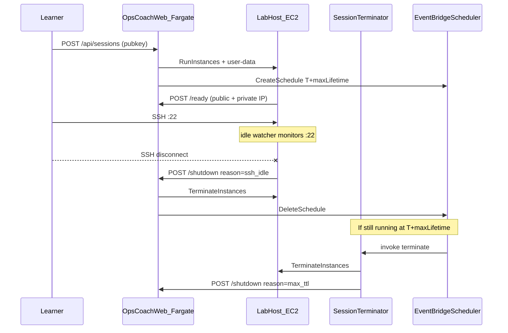

# Lab instance lifecycle design

**Status:** implemented (web + CDK).

Each learner session runs on a dedicated EC2 lab host (`t4g.micro`, Docker, one lab container). A leaked host costs money, so teardown is the load-bearing control. OpsCoach uses **three independent teardown paths** instead of one: any single path is enough to kill a host, and all three are safe to run more than once. The rest of this doc is why one path was not, and how each works.

## Problem

The web product does not embed a terminal. Learners SSH from their own client directly to the lab host's public IP, so the control plane (Next.js on Fargate) never sees SSH connect or disconnect events and cannot infer idle from browser activity. If teardown fails or never runs, instances leak and accumulate cost.

Teardown therefore has to be:

- **Prompt** when the learner is done, which means detecting SSH idle on the host itself.
- **Reliable** when callbacks fail, schedules are missed, or the learner never connects.
- **Idempotent** when several paths fire close together.

Non-goals for v1: SSH over a private overlay (no Tailscale; public IP only), and activity-based lifetime extension.

## The shape



SSH is pubkey-only on a hardened host. The grader runs from Fargate inside the VPC and reaches the instance over its **private** IP. Session state lives in Postgres; EC2 lifecycle is driven by the web task role and the terminator Lambda.

## The three paths

Each path stands alone. The table is the summary; the sections below are the mechanics and the reasoning for each tunable.

| Layer | Trigger | Actor | Typical latency |
|-------|---------|-------|-----------------|
| 1. SSH idle watcher | No established TCP sessions on host `:22` for the grace period, after at least one was seen | EC2 user-data background script | ~2 min after disconnect |
| 2. Max TTL schedule | One-time EventBridge Scheduler set at provision time | `OpsCoachSessionTerminator` Lambda | Exactly at T + max lifetime |
| 3. ExpiresAt sweep | `ExpiresAt` EC2 tag in the past | Same Lambda, every 5 min | Up to 5 min after tag expiry |

Manual **Stop lab** (the learner button) and authenticated `POST /api/sessions/:id/stop` use the same internal shutdown path as the webhooks.

Why three and not one: the idle watcher is prompt but blind to the case where the learner never connects; the timer is reliable but either too aggressive (kills active sessions) or too loose (leaks nodes) on its own; the sweep catches the host whose schedule was never created. Each covers the others' failure mode.

### Layer 1: SSH idle watcher

**Where:** generated shell user-data in [`../web/lib/lab-user-data.ts`](../web/lib/lab-user-data.ts), mirrored in [`../infra/lib/lab-user-data.sh`](../infra/lib/lab-user-data.sh) for launch-template defaults.

A background subshell loops every 15 seconds and counts established connections on local port 22 via `ss -tn state established '( sport = :22 )'`. It tracks `had_session`, set once the count exceeds zero. When `had_session` is set and the count returns to zero, it starts an idle clock; after `SSH_IDLE_GRACE_SECONDS` (default **120**) it POSTs the shutdown webhook:

```http
POST /api/sessions/:id/shutdown
X-Internal-Secret: <shared secret>
Content-Type: application/json

{ "reason": "ssh_idle" }
```

The 120-second grace avoids tearing down during brief disconnects (a network blip or an `ssh` reconnect) and lets a grader SSH from Fargate finish without racing the learner's disconnect.

Two known limits, both acceptable for v1. The watcher counts **all** connections on `:22`, including grader SSH from the VPC, so a learner who only runs checks from the web UI (never opening a terminal) may see the host torn down shortly after grading quiesces; a follow-up could filter by source IP. And if the learner never SSHes at all, `had_session` stays zero and this layer never fires, which is exactly what layer 2 is for.

### Layer 2: one-time EventBridge schedule (max TTL)

**Where:** [`../web/lib/session-scheduler.ts`](../web/lib/session-scheduler.ts), invoked from [`../web/lib/ec2-labs.ts`](../web/lib/ec2-labs.ts) after `RunInstances`.

On a successful provision, Fargate creates schedule `opscoach-{sessionId}` (truncated to 64 chars) with an `at(...)` expression in UTC set to **T + maxLifetimeMinutes**. The target is the `OpsCoachSessionTerminator` Lambda:

```json
{ "action": "terminate", "instanceId": "i-…", "sessionId": "…", "reason": "max_ttl" }
```

`ActionAfterCompletion: DELETE` removes the schedule once it fires, and any explicit shutdown (`manual`, `ssh_idle`) calls `DeleteSchedule` for idempotency.

The default max lifetime is **60 minutes** (`OPSCOACH_MAX_LIFETIME_MINUTES` / CDK context `maxLifetimeMinutes`): long enough for a typical session and a few assessment retries, short enough to bound cost if every other path fails. It is orthogonal to the SSH idle grace.

EventBridge **Scheduler** rather than EventBridge **Rules** because Scheduler supports one-time schedules natively, with per-session names and auto-delete. Rules suit recurring patterns, which is what layer 3 uses.

### Layer 3: ExpiresAt tag sweep

**Where:** [`../infra/lib/session-terminator/handler.py`](../infra/lib/session-terminator/handler.py), triggered every 5 minutes by an EventBridge Rule in [`../infra/lib/lab-host-stack.ts`](../infra/lib/lab-host-stack.ts).

At provision, `RunInstances` tags the instance `ExpiresAt=<ISO8601>` on the same horizon as the scheduler. The Lambda scans running OpsCoach instances (`OpsCoach=true`), and terminates any whose `ExpiresAt` is in the past, calling the shutdown API with `reason=expires_at_sweep`. This is the cheap safety net for the host whose schedule was never created (missing IAM, an API error during provision) or whose schedule drifted.

## Unified shutdown path

Every automated and manual teardown converges on [`shutdownSessionInternal`](../web/lib/sessions.ts):

1. Return early if already `stopped` or `stopping`.
2. Set status `stopping`.
3. `DeleteSchedule` (best effort).
4. `TerminateInstances` if an instance id is present (errors logged, still mark stopped).
5. Set status `stopped`, publish an SSE event.

There are two entry points. `POST /api/sessions/:id/stop` is authenticated by the session token and carries `reason=manual`. `POST /api/sessions/:id/shutdown` is authenticated by `X-Internal-Secret` and carries `ssh_idle`, `max_ttl`, `expires_at_sweep`, or `manual`. The terminator Lambda terminates EC2 first, then calls the shutdown API, so Postgres stays in sync.

## Configuration

**Runtime (Fargate task environment):**

| Variable | Default | Purpose |
|----------|---------|---------|
| `OPSCOACH_MAX_LIFETIME_MINUTES` | `60` | Scheduler fire time + `ExpiresAt` tag |
| `OPSCOACH_SSH_IDLE_GRACE_SECONDS` | `120` | Host idle debounce before the shutdown webhook |
| `SESSION_TERMINATOR_LAMBDA_ARN` | (CDK) | Schedule target |
| `SCHEDULER_INVOKE_ROLE_ARN` | (CDK) | Scheduler execution role |
| `INTERNAL_CALLBACK_SECRET` | Secrets Manager | Authenticates host and Lambda callbacks |

**CDK context** ([`../infra/lib/web-config.ts`](../infra/lib/web-config.ts)):

| Key | Default | Purpose |
|-----|---------|---------|
| `maxLifetimeMinutes` | `60` | Hard cap |
| `sshIdleGraceSeconds` | `120` | Passed to user-data |
| `idleTimeoutMinutes` | `10` | Legacy name; **not** used for `ExpiresAt` anymore |

**Mock / local dev:** without `EC2_LAUNCH_TEMPLATE_ID`, provisioning is mock-only (no scheduler, no host watcher), and sessions are in-memory unless `DATABASE_URL` is set. See [local-dev-without-aws.md](local-dev-without-aws.md).

## Security

Shutdown and ready callbacks require `X-Internal-Secret` (stored in Secrets Manager, created in the lab-host stack, read by the Fargate task role). EC2 terminate IAM is scoped with `OpsCoach=true` resource and request tags where possible. The host watcher can only initiate shutdown through the API; the lab instance role has no terminate permission, so it cannot kill instances directly.

## CDK components

| Resource | Stack | Role |
|----------|-------|------|
| `OpsCoachSessionTerminator` Lambda | `Dev-OpsCoachLabHost` | Direct terminate + sweep + shutdown API notify |
| `OpsCoachSchedulerInvoke` IAM role | Lab host | Lets Scheduler invoke the Lambda |
| EventBridge Rule (5 min) | Lab host | Sweep trigger |
| Callback secret | Lab host | Shared with Fargate |
| Scheduler IAM on task role | `Dev-OpsCoach` / web stack | `CreateSchedule` / `DeleteSchedule` |

Deploy wiring: [`../infra/bin/opscoach-platform.ts`](../infra/bin/opscoach-platform.ts), [`../infra/PLATFORM_INTEGRATION.md`](../infra/PLATFORM_INTEGRATION.md).

## Alternatives considered

| Approach | Rejected because |
|----------|------------------|
| Idle timeout from provision only (old `ExpiresAt = now + 10m`) | Kills active sessions; not true idle semantics |
| Web-only activity timeout | No visibility into SSH; a learner can be active in the terminal while the web tab is idle |
| Tailscale-only SSH | Explicit product decision: v1 is hardened public SSH only |
| Lambda per session (standalone) | Scheduler plus one shared terminator Lambda is simpler and cheaper |
| EC2 self-terminate via IAM | Broader blast radius on a compromised lab host; prefer API/Lambda gated by a secret |

## Future improvements

- **Source-aware idle detection:** count only SSH from non-VPC (learner) addresses, so web-only grading does not arm the idle watcher.
- **Activity extension:** refresh `ExpiresAt` and reschedule max TTL on a grader run or explicit heartbeat (trade cost for longer labs).
- **Metrics:** CloudWatch counters per teardown reason (`ssh_idle`, `max_ttl`, `expires_at_sweep`, `manual`) to tune the grace and TTL.
- **Hardened AMI:** a Packer image with Docker, fail2ban, and the watcher baked in, instead of a full user-data bootstrap.

## Related files

- [`../web/lib/ec2-labs.ts`](../web/lib/ec2-labs.ts): provision, tag, schedule.
- [`../web/lib/session-scheduler.ts`](../web/lib/session-scheduler.ts): EventBridge Scheduler client.
- [`../web/app/api/sessions/[id]/shutdown/route.ts`](../web/app/api/sessions/[id]/shutdown/route.ts): internal shutdown API.
- [`../infra/lib/lab-host-stack.ts`](../infra/lib/lab-host-stack.ts): terminator Lambda + scheduler role.
- [`../infra/lib/opscoach-service-stack.ts`](../infra/lib/opscoach-service-stack.ts): Fargate env + scheduler IAM.
