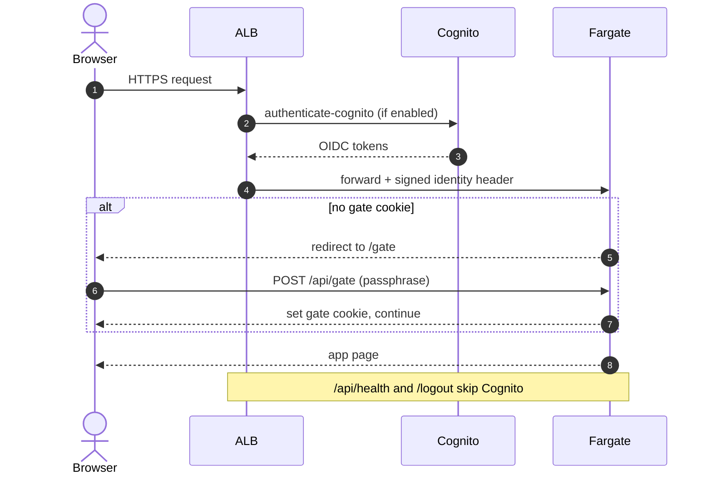
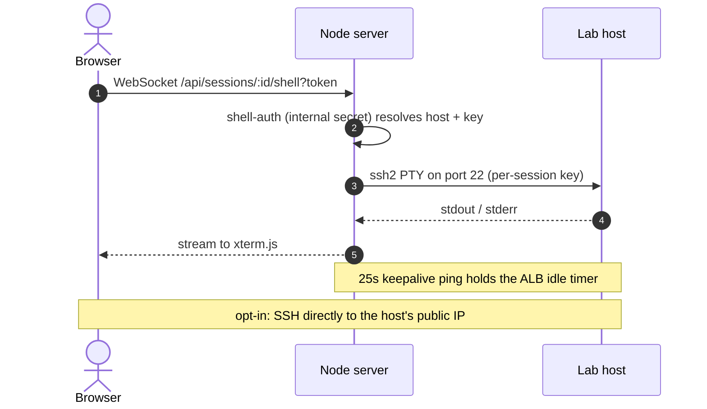
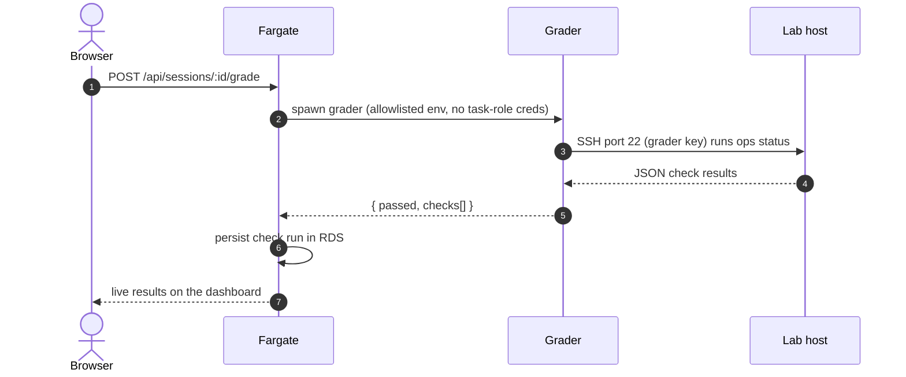

# OpsCoach architecture

OpsCoach hands each learner a real, throwaway Linux host and grades what they actually do to it. This doc descends from 30,000 feet to the design decisions behind it.

**Scope.** Single-region training infrastructure for one app that borrows a shared ALB, Cognito, and VPC platform instead of standing up its own. Explicitly not a hostile multi-tenant sandbox, and not a high-availability production service.

## 30,000 ft · the shape

Three parts, and everything else is how they talk to each other safely:

- A **web app** (Next.js on ECS Fargate) that serves the UI, bridges the browser terminal to a shell, and runs grading.
- A **per-session lab host** (a dedicated EC2 instance) that the learner operates and that is destroyed on a timer.
- A **shared platform** (ALB, Cognito, VPC) that the app plugs into by ID rather than rebuilding.

The engineering lives in the seams: handing an untrusted user root on a real machine without putting anything else at risk, holding a live shell open through a load balancer, and guaranteeing that no host outlives its session.

## 10,000 ft · the system


The numbered arrows trace one session from first request to teardown.

1. **Request.** Browser to the ALB over HTTPS. The ALB runs `authenticate-cognito` (Cognito hosted UI, Google), and a post-auth passphrase gate inside the app must also pass before any page renders. Only the health check and logout skip Cognito.
2. **Route.** The ALB forwards to the OpsCoach web service on Fargate, in a private, egress-only subnet.
3. **Provision and grade.** Fargate launches the host with `RunInstances`, then later runs the grader against it over SSH. Both ride one control link (a single arrow in the diagram). The learner's own terminal is a separate path (step 5).
4. **Ready webhook.** The host calls back to the service once it is up, resolved through Cloud Map and authenticated with a shared secret.
5. **Terminal.** The learner operates the box here: the browser streams over a WebSocket to a custom Node server, which relays to the host's shell over SSH.
6. **Teardown.** Three independent, idempotent paths guarantee the host dies (the numbered arrow is the terminate). Any one suffices.

Grey dashed lines are supporting paths: Fargate to RDS PostgreSQL in the isolated subnet, the host pulling its lab image from ECR, and the opt-in direct SSH from a learner's laptop.

### Components

| Component | AWS service | Role |
| --- | --- | --- |
| Web app + terminal bridge | ECS Fargate | Serves UI; WebSocket-to-SSH PTY bridge; session lifecycle + grading |
| Edge auth | ALB + Cognito | `authenticate-cognito` at the load balancer (hosted UI to Google), then a shared-passphrase gate in the app |
| Lab host | EC2 (per session) | Ephemeral AL2023 / arm64 host running the lab container; learner's SSH target |
| Container images | ECR | Images for the web service and each lab |
| Database | RDS PostgreSQL | Sessions, check runs, grader results (isolated subnet) |
| Service discovery | Cloud Map | In-VPC address for lab-host-to-web callbacks |
| Teardown | On-host watcher + EventBridge Scheduler + Lambda | SSH-idle shutdown, one-shot max-lifetime schedule, expiry-tag sweep |
| Secrets | Secrets Manager | Database credentials and the callback HMAC secret |

<details>
<summary><b>The flows, step by step</b> (auth, provision, terminal, grading, teardown)</summary>

&nbsp;

**Authentication and access gate**



**Provision a lab session**

```mermaid
sequenceDiagram
    autonumber
    actor U as Browser
    participant App as Fargate
    participant EC2 as Lab host
    participant ECR as ECR
    participant Sch as Scheduler
    U->>App: POST /api/sessions (start lab)
    App->>App: create session in RDS; mint keys + callback token
    App->>EC2: RunInstances (Launch Template + user-data)
    App->>Sch: CreateSchedule (terminate at T + maxLifetime)
    Note over EC2: user-data: install Docker, block IMDS,<br/>ECR login, run lab container, set authorized_keys
    EC2->>ECR: pull lab image
    EC2->>App: ready webhook (via Cloud Map + shared secret)
    App-->>U: session ready (host, port)
```

**Browser terminal and SSH**



**Live grading**



**Idle and lifetime teardown**

```mermaid
sequenceDiagram
    autonumber
    participant EC2 as Lab host
    participant App as Fargate
    participant Sch as Scheduler
    participant L as Terminator Lambda
    Note over EC2: path 1 (prompt): on-host watcher polls :22
    EC2->>App: no SSH for grace period: shutdown (reason=ssh_idle)
    App->>EC2: TerminateInstances; delete schedule
    Note over Sch,L: path 2 (hard cap): if still running at T + maxLifetime
    Sch->>L: fire one-shot
    L->>EC2: TerminateInstances
    L->>App: shutdown callback (mark session stopped)
    Note over EC2,App: path 3 (backstop): 5-min EventBridge sweep<br/>terminates any host past its ExpiresAt tag
```

</details>

## 1,000 ft · the decisions that shaped it

Each of these is a place the obvious choice would have been wrong. Constraint, decision, trade-off.

**A real host per session, not a shared sandbox.**
Constraint: teaching operations means real systemd, real root, real packages, and you cannot hand untrusted users root on shared infrastructure. Both cheaper alternatives (a shared multi-tenant host, or browser-only containers) make container isolation the only wall between a hostile learner and everyone else, so a single escape compromises every session. Decision: every session gets its own ephemeral EC2 host, killed on a timer. The security model treats that host, not the container on it, as the real boundary. Trade-off: a minute or two of provisioning latency and per-session cost, in exchange for a blast radius of exactly one throwaway box, and a learner operating a real machine rather than a simulation. Full model in [security.md](security.md).

**A custom Node server for the browser terminal.**
Constraint: a browser terminal needs a long-lived, two-way connection to a shell, and Next.js on its own does not hold one. Decision: wrap Next in a thin `server.js`. It leaves every normal request to the stock Next handler and intercepts only the WebSocket upgrade, where it authenticates the session through an internal call and bridges to the host with an `ssh2` PTY. Trade-off: a custom server instead of stock Next, plus a 25-second keepalive ping so the ALB does not reap an idle terminal, in exchange for a real shell in the browser with nothing for the learner to install.

**Grade real state, not answers.**
Constraint: a fixed answer key tells you the learner typed the expected command, not that the box ended up in the right state. Decision: the grader SSHes into the live host with a least-privilege environment and checks real state (services up, files in place, config correct), returning structured results that stream to the dashboard as each check completes. Trade-off: graders are per-pack code that has to run against a live machine, in exchange for a pass that means the box is genuinely in the right state, not that the learner ran the expected commands.

**Three independent teardown paths.**
Constraint: a leaked instance costs real money, and the control plane never sees the learner's SSH activity, so it cannot infer idle from browser traffic. Decision: an on-host SSH-idle watcher, a one-shot EventBridge Scheduler set at provision time, and a 5-minute sweep over expiry tags. Any one path is sufficient, and all are idempotent. Trade-off: more moving parts, for a hard guarantee that nothing runs forever. Full design in [lab-lifecycle-design.md](lab-lifecycle-design.md).

**Borrow the platform; import by ID.**
Constraint: a demo should not stand up its own ALB, Cognito, and VPC. Decision: the CDK imports a shared platform's resources by ID from local context, and the real IDs stay out of the repo (placeholders ship in their place). Trade-off: the app cannot bootstrap its own world from nothing, in exchange for dropping cleanly into an existing shared environment.

## See also

- **[security.md](security.md)** for the security model and its trade-offs.
- **[lab-lifecycle-design.md](lab-lifecycle-design.md)** for provisioning and the three-layer teardown in depth.
- **[../infra/PLATFORM_INTEGRATION.md](../infra/PLATFORM_INTEGRATION.md)** for plugging into a shared ALB/Cognito platform.
