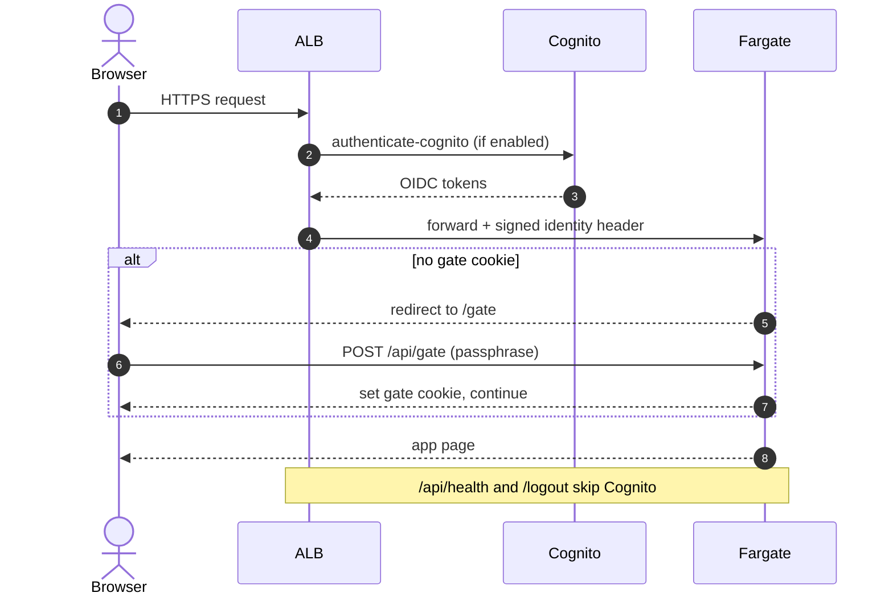
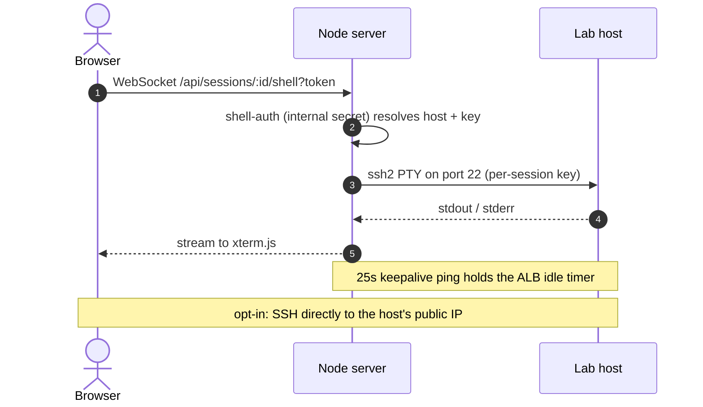
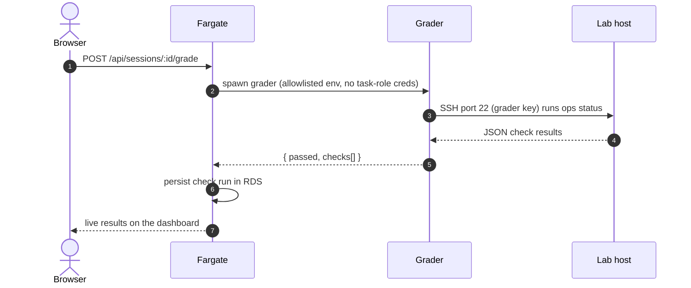
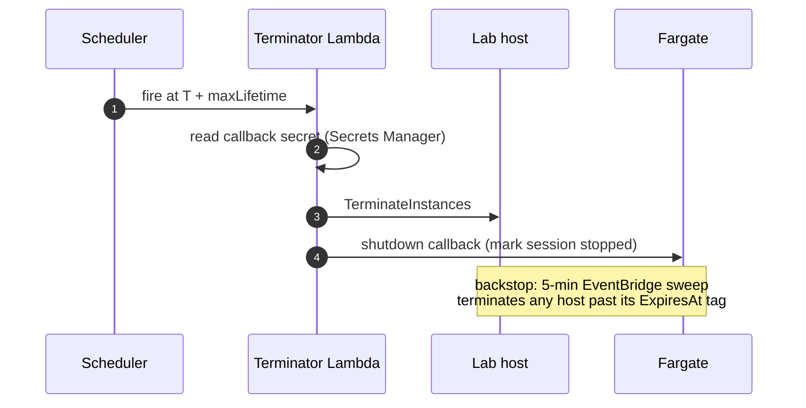

# OpsCoach architecture

**Status: v1.0**

OpsCoach gives each learner a throwaway Linux host and grades what they do to it. This doc starts at 30,000 feet and drops to the decisions worth defending. Skim the top; stop where you care.

**Scope:** single-region training infrastructure for one app that borrows a shared ALB/Cognito platform. Not a hostile multi-tenant sandbox, and not a high-availability production service.

## 30,000 ft · the shape

The whole system is three parts:

- A **web app** (Next.js on ECS Fargate) that serves the UI, bridges the terminal, and runs grading.
- A **per-session lab host** (a dedicated EC2 instance) that the learner operates and that is destroyed on a timer.
- A **shared platform** (ALB, Cognito, VPC) that the app plugs into instead of rebuilding.

Everything below is how those three talk to each other safely.

## 10,000 ft · the system


The numbered arrows above:

1. **Request.** Browser to the ALB over HTTPS. The ALB runs `authenticate-cognito` (Cognito hosted UI, Google); a post-auth passphrase gate in the app must also pass before any page renders. Only the health check and logout skip Cognito.
2. **Route.** The ALB forwards to the OpsCoach web service on Fargate, in a private, egress-only subnet.
3. **Provision, operate, grade.** Fargate launches and drives the per-session EC2 host: `RunInstances` at the start, an SSH PTY for the browser terminal, and the grader over SSH.
4. **Ready webhook.** The host calls back to the service once it is up, resolved through Cloud Map and authenticated with a shared secret.
5. **Terminal.** The browser streams over a WebSocket to the custom Node server, which relays to the host's shell over SSH.
6. **Teardown.** A per-session EventBridge Scheduler one-shot triggers the terminator Lambda; a 5-minute sweep is the backstop.

Grey dashed lines are supporting paths: Fargate to RDS PostgreSQL in the isolated subnet, the host pulling its lab image from ECR, and the opt-in direct SSH from a learner's laptop.

Colour key: purple is networking (ALB, Cloud Map); orange is compute and containers (Fargate, EC2, Lambda, ECR); red is identity and secrets (Cognito, Secrets Manager); blue is the database (RDS); pink is app integration (EventBridge Scheduler).

### Components

| Component | AWS service | Role |
| --- | --- | --- |
| Web app + terminal bridge | ECS Fargate | Next.js app + custom Node server; WebSocket→SSH PTY bridge; session lifecycle, grading, dashboard |
| Edge auth | ALB + Cognito | `authenticate-cognito` at the load balancer (hosted UI → Google), then a post-auth passphrase gate |
| Lab host | EC2 (per session) | Ephemeral AL2023 / arm64 host running the lab container; learner SSH target |
| Container images | ECR | Images for the web service and each lab |
| Database | RDS PostgreSQL | Sessions, check runs, grader results (isolated subnet) |
| Service discovery | Cloud Map | In-VPC address for lab-host to web callbacks |
| Teardown | EventBridge Scheduler + Lambda | One-shot per-session schedule fires a terminator Lambda; 5-minute sweep backstop |
| Secrets | Secrets Manager | Database credentials and the callback HMAC secret |

<details>
<summary><b>The flows, step by step</b> (auth, provision, terminal, grading, teardown)</summary>

&nbsp;

**1 · Authentication and access gate**



**2 · Provision a lab session**

```mermaid
sequenceDiagram
    autonumber
    actor U as Browser
    participant App as Fargate
    participant EC2 as Lab host
    participant ECR as ECR
    participant Sch as Scheduler
    U->>App: POST /api/sessions (start lab)
    App->>App: create session in RDS; mint keys + callback token
    App->>EC2: RunInstances (Launch Template + user-data)
    App->>Sch: CreateSchedule (terminate at T + maxLifetime)
    Note over EC2: user-data: install Docker, block IMDS,<br/>ECR login, run lab container, set authorized_keys
    EC2->>ECR: pull lab image
    EC2->>App: ready webhook (via Cloud Map + shared secret)
    App-->>U: session ready (host, port)
```

**3 · Browser terminal and SSH**



**4 · Live grading**



**5 · Idle and lifetime teardown**



</details>

## 1,000 ft · the decisions that shaped it

Each was a fork where the obvious choice was wrong.

**A host per session, not a shared sandbox.**
Teaching operations means actual systemd, root, and packages. But you cannot hand untrusted users root on shared infrastructure. The cheap alternatives, a shared multi-tenant host or browser-only containers, make container isolation the only wall between a hostile learner and everyone else. One escape would compromise every session. So each session gets its own ephemeral EC2 host. The security model treats that host, not the container on it, as the boundary, and kills it on a timer. That costs a minute or two of provisioning and some per-session spend. In exchange, the blast radius is exactly one throwaway box. Full model in [security.md](security.md).

**A custom Node server for the browser terminal.**
A browser terminal needs a long-lived, two-way connection to a shell, and Next.js does not hold one. So a thin `server.js` wraps Next. It upgrades the WebSocket, authenticates the session through an internal call, and bridges to the host with an `ssh2` PTY. The price is a custom server instead of stock Next, plus a 25-second keepalive so the ALB does not cut an idle terminal. In exchange, there is no client or agent to install: the terminal works from any browser, including behind a corporate firewall.

**Grade state, not answers.**
Multiple-choice cannot tell you whether someone can run a box. So the grader SSHes into the live host with a least-privilege environment and checks the state directly (services up, files in place, config correct), then returns structured results. Graders are per-pack code that runs against a live machine. In exchange, a pass is not fakeable: the only way to earn it is to leave a genuinely working machine behind.

**Three independent teardown paths.**
A leaked instance costs money, and the control plane never sees the learner's SSH activity. So teardown has three independent layers: an on-host SSH-idle watcher, a one-shot EventBridge Scheduler set at provision time, and a 5-minute sweep over expiry tags. Any one is enough, and all are idempotent. More moving parts, for a hard guarantee that nothing runs forever. Full design in [lab-lifecycle-design.md](lab-lifecycle-design.md).

**Borrow the platform; import by ID.**
A demo should not stand up its own ALB, Cognito, and VPC. So the CDK imports a shared platform's resources by ID from local context, and the IDs stay out of the repo. The cost: you cannot stand the system up in a fresh AWS account until the shared platform already exists.

## See also

- **[security.md](security.md)** for the security model and its trade-offs.
- **[lab-lifecycle-design.md](lab-lifecycle-design.md)** for provisioning and the three-layer teardown in depth.
- **[../infra/PLATFORM_INTEGRATION.md](../infra/PLATFORM_INTEGRATION.md)** for plugging into a shared ALB/Cognito platform.
