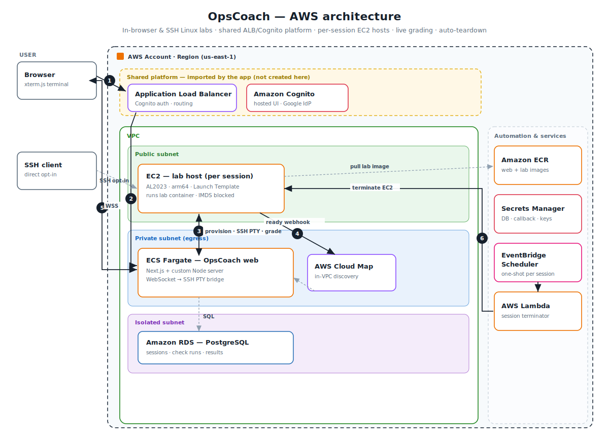
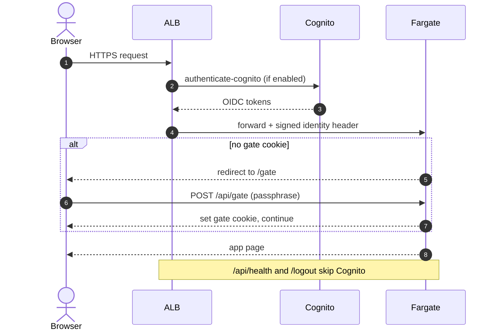
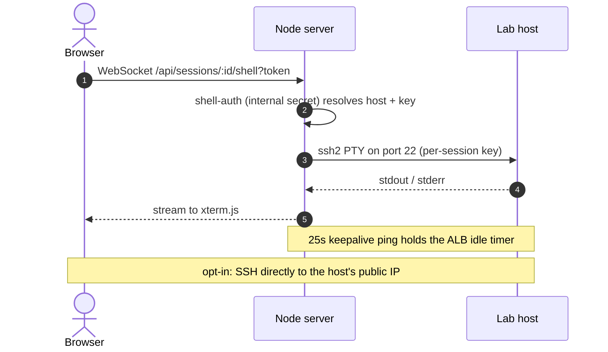
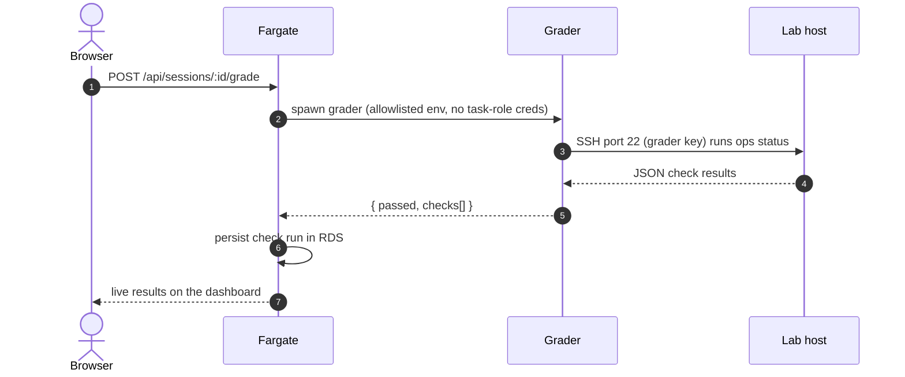
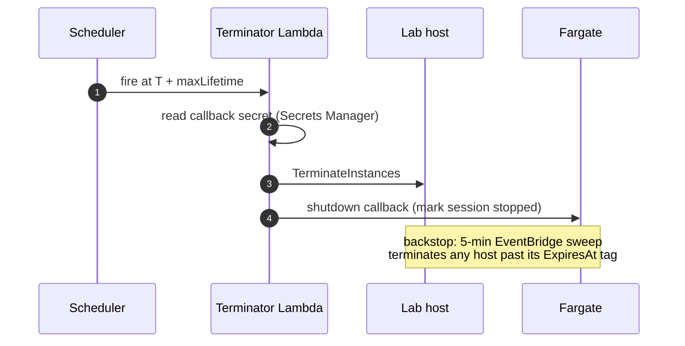

# OpsCoach architecture

OpsCoach runs its web app as a container on **ECS Fargate** behind a **shared ALB + Cognito** platform, and gives each learner a dedicated, ephemeral **EC2** lab host. The web service bridges the in-browser terminal to that host over SSH, runs a grader against real system state, and tears the host down automatically.

## System topology



The numbered arrows above:

1. **Request.** Browser to the ALB over HTTPS. The ALB runs `authenticate-cognito` (Cognito hosted UI, Google); a post-auth passphrase gate in the app must also pass before any page renders. Only the health check and logout skip Cognito.
2. **Route.** The ALB forwards to the OpsCoach web service on Fargate, in a private, egress-only subnet.
3. **Provision, operate, grade.** Fargate launches and drives the per-session EC2 host: `RunInstances` at the start, an SSH PTY for the browser terminal, and the grader over SSH.
4. **Ready webhook.** The host calls back to the service once it is up, resolved through Cloud Map and authenticated with a shared secret.
5. **Terminal.** The browser streams over a WebSocket to the custom Node server, which relays to the host's shell over SSH.
6. **Teardown.** A per-session EventBridge Scheduler one-shot triggers the terminator Lambda; a 5-minute sweep is the backstop.

Grey dashed lines are supporting paths: Fargate to RDS PostgreSQL in the isolated subnet, the host pulling its lab image from ECR, and the opt-in direct SSH from a learner's laptop.

Colour key: purple is networking (ALB, Cloud Map); orange is compute and containers (Fargate, EC2, Lambda, ECR); red is identity and secrets (Cognito, Secrets Manager); blue is the database (RDS); pink is app integration (EventBridge Scheduler).

## Key flows

### 1 · Authentication and access gate



### 2 · Provision a lab session

```mermaid
sequenceDiagram
    autonumber
    actor U as Browser
    participant App as Fargate
    participant EC2 as Lab host
    participant ECR as ECR
    participant Sch as Scheduler
    U->>App: POST /api/sessions (start lab)
    App->>App: create session in RDS; mint keys + callback token
    App->>EC2: RunInstances (Launch Template + user-data)
    App->>Sch: CreateSchedule (terminate at T + maxLifetime)
    Note over EC2: user-data: install Docker, block IMDS,<br/>ECR login, run lab container, set authorized_keys
    EC2->>ECR: pull lab image
    EC2->>App: ready webhook (via Cloud Map + shared secret)
    App-->>U: session ready (host, port)
```

### 3 · Browser terminal and SSH



### 4 · Live grading



### 5 · Idle and lifetime teardown



## Components

| Component | AWS service | Role |
| --- | --- | --- |
| Web app + terminal bridge | ECS Fargate | Next.js app + custom Node server; WebSocket→SSH PTY bridge; session lifecycle, grading, dashboard |
| Edge auth | ALB + Cognito | `authenticate-cognito` at the load balancer (hosted UI → Google), then a post-auth passphrase gate |
| Lab host | EC2 (per session) | Ephemeral AL2023 / arm64 host running the lab container; learner SSH target |
| Container images | ECR | Images for the web service and each lab |
| Database | RDS PostgreSQL | Sessions, check runs, grader results (isolated subnet) |
| Service discovery | Cloud Map | In-VPC address for lab-host to web callbacks |
| Teardown | EventBridge Scheduler + Lambda | One-shot per-session schedule fires a terminator Lambda; 5-minute sweep backstop |
| Secrets | Secrets Manager | Database credentials and the callback HMAC secret |

## Security

In one line: each session is a single-tenant, credential-poor EC2 host that self-destructs on a timer, so an escaped lab container controls one throwaway box and nothing else. The full model and its trade-offs are in **[security.md](security.md)**.

## See also

- **[security.md](security.md)** for the security model.
- **[lab-lifecycle-design.md](lab-lifecycle-design.md)** for how provisioning and the three-layer teardown actually work.
- **[../infra/PLATFORM_INTEGRATION.md](../infra/PLATFORM_INTEGRATION.md)** for plugging into a shared ALB/Cognito platform.
