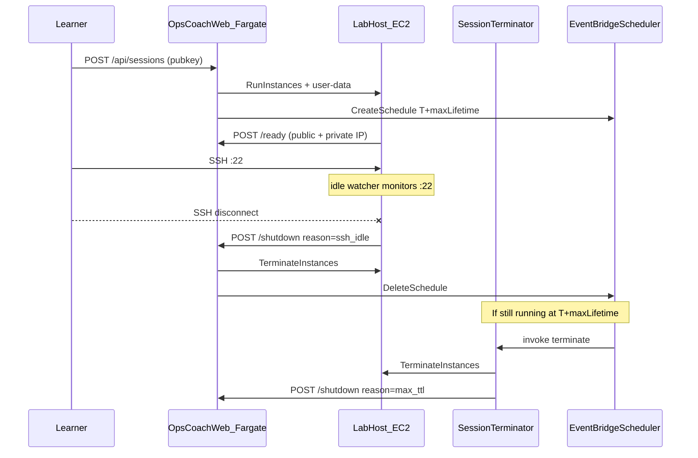

# Lab instance lifecycle design

**Status: v1.0 · implemented (web + CDK)**

This document records how Ops Coach provisions per-session EC2 lab hosts in the web deployment, how those instances are torn down, and why we chose a layered approach instead of relying on a single cleanup mechanism.

## Problem

Each learner session can spawn a dedicated EC2 instance (t4g.micro) running Docker with the lab container. If teardown fails or never runs, instances leak and accumulate cost.

Unlike the native macOS app, the web product does **not** embed a terminal. Learners SSH from their own client directly to the lab host's public IP. The control plane (Next.js on Fargate) never sees SSH connect/disconnect events, so it cannot infer idle state from browser activity alone.

We need teardown that is:

- **Prompt** when the learner is done (SSH idle).
- **Reliable** when callbacks fail, schedules are missed, or the learner never connects.
- **Idempotent** when multiple paths fire close together.

## Architecture context



**Key constraints:**

- SSH is pubkey-only on a hardened host (v1: public IP; no Tailscale).
- Grader runs from Fargate inside the VPC and SSHs to the instance **private IP**.
- Session state lives in Postgres; EC2 lifecycle is driven by the web task role and terminator Lambda.

## Design principle: defense in depth

We use **three independent teardown paths**. Any one path succeeding is sufficient; all paths are safe to run more than once.

| Layer | Actor | Typical latency |
|-------|-------|-----------------|
| 1. SSH idle watcher | EC2 user-data background script | ~2 min after disconnect |
| 2. Max TTL schedule | `OpsCoachSessionTerminator` Lambda | Exactly at T + max lifetime |
| 3. ExpiresAt sweep | Same Lambda, every 5 min | Up to 5 min after tag expiry |

### Why not only SSH idle?

The control plane does not terminate SSH. Without a host-side agent, we would only discover idle state when the learner clicks Stop or when a coarse timer fires. SSH idle detection closes the gap for the common case: learner closes their terminal and walks away.

### Why not only a timer?

Timers alone are either too aggressive (kill active sessions) or too loose (leak nodes). A fixed max lifetime is necessary as a **backstop** for:

- Failed shutdown webhooks (network, secret mismatch, API down).
- Learners who never SSH (instance still costs money).
- Bugs in the idle watcher.

### Why both Scheduler and ExpiresAt sweep?

The Scheduler is the primary hard cap; the sweep is its fallback, on the same horizon.

- **EventBridge Scheduler** fires once per session at a precise time and deletes itself after completion.
- **`ExpiresAt` tag + sweep** uses the same max-lifetime horizon as the schedule, so it is not a third latency that routinely races the others. It is the fallback for when schedule creation failed (missing IAM, API error during provision) or AWS Scheduler drift left an instance running past its time. The sweep reuses the same terminator Lambda.

## Layer 1: SSH idle watcher

**Location:** Generated shell user-data in [`web/lib/lab-user-data.ts`](../web/lib/lab-user-data.ts) (also mirrored in [`infra/lib/lab-user-data.sh`](../infra/lib/lab-user-data.sh) for launch-template defaults).

**Behavior:**

1. After bootstrap, a background subshell loops every 15 seconds.
2. Count established connections on local port 22 via `ss -tn state established '( sport = :22 )'`.
3. Track `had_session`: set to 1 once count &gt; 0 at least once.
4. When `had_session` is 1 and count is 0, start an idle clock.
5. If idle for `SSH_IDLE_GRACE_SECONDS` (default **120**), POST shutdown webhook.

**Webhook:**

```http
POST /api/sessions/:id/shutdown
X-Internal-Secret: <shared secret>
Content-Type: application/json

{ "reason": "ssh_idle" }
```

**Rationale for 120s grace:**

- Avoid tearing down during brief disconnects (network blip, `ssh` reconnect).
- Allow grader SSH from Fargate to complete without racing the learner disconnect in edge cases.

**Known limitation:** The watcher counts **all** connections on host `:22`, including grader SSH from the VPC. A learner who never opens a terminal but repeatedly runs checks from the web UI may still see the instance terminated shortly after grading quiesces. Acceptable for v1; a follow-up could filter by source IP (e.g. only non-RFC1918) if needed.

**Known limitation:** If the learner never SSHs, `had_session` stays 0 and the idle watcher never fires. Max TTL (layer 2) handles that case.

## Layer 2: One-time EventBridge schedule (max TTL)

**Location:** [`web/lib/session-scheduler.ts`](../web/lib/session-scheduler.ts), invoked from [`web/lib/ec2-labs.ts`](../web/lib/ec2-labs.ts) after `RunInstances`.

**Behavior:**

1. On successful provision, Fargate creates schedule `opscoach-{sessionId}` (truncated to 64 chars).
2. Expression: `at(yyyy-mm-ddThh:mm:ss)` in UTC, **T + maxLifetimeMinutes** from provision time.
3. Target: `OpsCoachSessionTerminator` Lambda with payload:

   ```json
   { "action": "terminate", "instanceId": "i-…", "sessionId": "…", "reason": "max_ttl" }
   ```

4. `ActionAfterCompletion: DELETE` removes the schedule after it fires.
5. Any explicit shutdown (`manual`, `ssh_idle`) calls `DeleteSchedule` for idempotency.

**Default max lifetime:** set by `OPSCOACH_MAX_LIFETIME_MINUTES` / CDK context `maxLifetimeMinutes` (see the Configuration tables).

**Rationale for that default:**

- Long enough for a typical lab session and assessment retries.
- Short enough to bound cost if all other teardown paths fail.
- Independent of SSH idle grace (orthogonal concerns).

**Why EventBridge Scheduler (not EventBridge Rules)?**

Scheduler supports **one-time** schedules natively with per-session names and auto-delete. Rules are better suited to recurring patterns (like the 5-minute sweep).

## Layer 3: ExpiresAt tag sweep

**Location:** [`infra/lib/session-terminator/handler.py`](../infra/lib/session-terminator/handler.py), triggered every 5 minutes by EventBridge Rule in [`infra/lib/lab-host-stack.ts`](../infra/lib/lab-host-stack.ts).

**Behavior:**

1. At provision, `RunInstances` tags the instance with `ExpiresAt=<ISO8601>` aligned to **max lifetime** (same horizon as the scheduler).
2. Lambda scans running Ops Coach instances (`OpsCoach=true`).
3. If `ExpiresAt <= now`, terminate and call shutdown API with `reason=expires_at_sweep`.

**Rationale:** the fallback described under "Why both Scheduler and ExpiresAt sweep?" above.

## Unified shutdown path

All automated and manual teardown converges on [`shutdownSessionInternal`](../web/lib/sessions.ts):

1. Idempotent if already `stopped` / `stopping`.
2. Set status `stopping`.
3. `DeleteSchedule` (best effort).
4. `TerminateInstances` if instance id present (errors logged, still mark stopped).
5. Set status `stopped`, publish SSE event.

**Entry points:**

| Entry | Auth | Reason |
|-------|------|--------|
| `POST /api/sessions/:id/stop` | Session token | `manual` |
| `POST /api/sessions/:id/shutdown` | `X-Internal-Secret` | `ssh_idle`, `max_ttl`, `expires_at_sweep`, `manual` |

The terminator Lambda terminates EC2 first, then calls the shutdown API so Postgres stays in sync.

## Configuration

### Runtime (Fargate task environment)

| Variable | Default | Purpose |
|----------|---------|---------|
| `OPSCOACH_MAX_LIFETIME_MINUTES` | `60` | Scheduler fire time + `ExpiresAt` tag |
| `OPSCOACH_SSH_IDLE_GRACE_SECONDS` | `120` | Host idle debounce before shutdown webhook |
| `SESSION_TERMINATOR_LAMBDA_ARN` | (CDK) | Schedule target |
| `SCHEDULER_INVOKE_ROLE_ARN` | (CDK) | Scheduler execution role |
| `INTERNAL_CALLBACK_SECRET` | Secrets Manager | Authenticates host/Lambda callbacks |

### CDK context ([`infra/lib/web-config.ts`](../infra/lib/web-config.ts))

| Key | Default | Purpose |
|-----|---------|---------|
| `maxLifetimeMinutes` | `60` | Hard cap |
| `sshIdleGraceSeconds` | `120` | Passed to user-data |
| `idleTimeoutMinutes` | `10` | Vestigial: not read by teardown; kept only to avoid a churny rename |

### Mock / local dev

Without `EC2_LAUNCH_TEMPLATE_ID`, provisioning is mock-only: no scheduler, no host watcher. Sessions are in-memory unless `DATABASE_URL` is set.

## Security

- Shutdown and ready callbacks require `X-Internal-Secret` (stored in Secrets Manager, created in lab-host stack, read by Fargate task role).
- EC2 terminate IAM is scoped with `OpsCoach=true` resource/request tags where possible.
- Host watcher only initiates shutdown; it cannot terminate instances directly (no IAM on lab instance role for terminate).

## CDK components

| Resource | Stack | Role |
|----------|-------|------|
| `OpsCoachSessionTerminator` Lambda | `Dev-OpsCoachLabHost` | Direct terminate + sweep + shutdown API notify |
| `OpsCoachSchedulerInvoke` IAM role | Lab host | Lets Scheduler invoke Lambda |
| EventBridge Rule (5 min) | Lab host | Sweep trigger |
| Callback secret | Lab host | Shared with Fargate |
| Scheduler IAM on task role | `Dev-OpsCoach` / web stack | `CreateSchedule` / `DeleteSchedule` |

Deploy wiring: [`infra/bin/opscoach-platform.ts`](../infra/bin/opscoach-platform.ts), [`infra/PLATFORM_INTEGRATION.md`](../infra/PLATFORM_INTEGRATION.md).

## Alternatives considered

| Approach | Rejected because |
|----------|------------------|
| Idle timeout from provision only (old `ExpiresAt = now + 10m`) | Kills active sessions; not true idle semantics |
| Web-only activity timeout | No visibility into SSH; learner can be active in terminal while web tab is idle |
| Tailscale-only SSH | Explicit product decision: v1 hardened public SSH only |
| Lambda per session (standalone) | Scheduler + one shared terminator Lambda is simpler and cheaper |
| EC2 instance self-terminate via IAM | Broader blast radius on compromised lab host; prefer API/Lambda with secret |

## Future improvements

- **Source-aware idle detection:** Only count SSH from non-VPC (learner) addresses so web-only grading does not arm the idle watcher incorrectly.
- **Activity extension:** Refresh `ExpiresAt` and reschedule max TTL on grader run or explicit heartbeat (trade cost for longer labs).
- **Metrics:** CloudWatch counters for teardown reason (`ssh_idle`, `max_ttl`, `expires_at_sweep`, `manual`) to tune grace and TTL.
- **Hardened AMI:** Packer image with Docker pre-installed, fail2ban, and watcher baked in instead of full user-data bootstrap.

## Related files

- [`web/lib/ec2-labs.ts`](../web/lib/ec2-labs.ts): provision, tag, schedule
- [`web/lib/session-scheduler.ts`](../web/lib/session-scheduler.ts): EventBridge Scheduler client
- [`web/app/api/sessions/[id]/shutdown/route.ts`](../web/app/api/sessions/[id]/shutdown/route.ts): internal shutdown API
- [`infra/lib/lab-host-stack.ts`](../infra/lib/lab-host-stack.ts): terminator Lambda + scheduler role
- [`infra/lib/opscoach-service-stack.ts`](../infra/lib/opscoach-service-stack.ts): Fargate env + scheduler IAM
